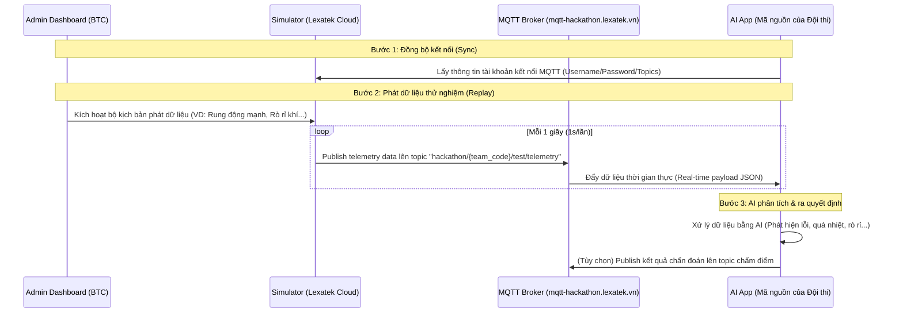

# HƯỚNG DẪN TÍCH HỢP MQTT & BỘ GIẢ LẬP SENSOR (SIMULATOR)
## SEAL Hackathon Summer 2026

Chào các bạn, dưới góc độ của một **Senior Solution Architect**, tôi đã khảo sát toàn bộ mã nguồn của dự án và chuẩn bị tài liệu này nhằm giải thích chi tiết, trực quan về cơ chế **MQTT**, vai trò của nó trong cuộc thi và cách thức triển khai/tích hợp thực tế cho các đội thi.

---

## 1. MQTT là gì? Tại sao lại dùng trong SEAL Hackathon?

### MQTT là gì?
**MQTT (Message Queuing Telemetry Transport)** là giao thức truyền thông điệp theo mô hình **Publish/Subscribe** (Xuất bản/Đăng ký) cực kỳ nhẹ, tối ưu cho các thiết bị IoT (Internet of Things) hoạt động trong môi trường băng thông thấp hoặc mạng không ổn định.

Khác với HTTP truyền thống (Client gửi Request, Server trả Response), MQTT hoạt động thông qua một **Broker** trung gian:
- **Broker (Máy chủ):** Nhận tin nhắn từ bên gửi và chuyển tiếp đến đúng những bên đăng ký nhận. Broker của cuộc thi là `mqtt-hackathon.lexatek.vn`.
- **Publish (Gửi):** Thiết bị phát dữ liệu (Simulator của BTC) gửi bản tin kèm theo một chủ đề phân cấp gọi là **Topic** (ví dụ: `hackathon/team_a/test/telemetry`).
- **Subscribe (Nhận):** Ứng dụng tiêu thụ dữ liệu (AI App của đội thi) đăng ký lắng nghe một Topic để nhận dữ liệu ngay lập tức dưới dạng thời gian thực (Real-time Push).

### Vai trò trong cuộc thi
Với chủ đề **"AI-Driven Smart Operations: Turning Real-Time IoT Data into Intelligent Actions"**, đề thi yêu cầu các đội phải xử lý dữ liệu thời gian thực từ 6 loại thiết bị cảm biến công nghiệp:
1. **CONVEYOR** (Băng chuyền): Đo tốc độ (speed), tải trọng (load).
2. **GAS** (Khí gas): Đo nồng độ gas.
3. **LINE** (Đường truyền tải): Đo điện áp (voltage), dòng điện (current).
4. **MOTOR** (Động cơ): Đo dòng điện, độ rung (vibration), nhiệt độ (temperature).
5. **PRESS** (Máy dập): Đo áp suất (pressure).
6. **PROBE** (Đầu dò): Đo nhiệt độ.

👉 **Simulator của BTC** sẽ liên tục đẩy (Publish) dữ liệu của 6 thiết bị này lên Broker mỗi giây 1 lần. Đội thi đăng ký nhận (Subscribe) để thu thập dữ liệu này, đưa vào mô hình AI để phân tích, phát hiện bất thường (anomalies) và hiển thị lên Dashboard.

---

## 2. Luồng Dữ Liệu Tổng Thể (Data Flow Architecture)



---

## 3. Cách lấy thông tin kết nối và Test thử nghiệm

### Bước 1: Lấy tài khoản MQTT của đội thi
Tại trang **Khu vực đội thi (Team Portal)**, hệ thống có một card tên là `[MQTT_CREDENTIALS]`.
1. Nhấp vào nút **"Đồng bộ kết nối"** (Sync connection).
2. Hệ thống sẽ kết nối với simulator bên Lexatek để lấy thông tin tài khoản của bạn:
   - **Broker Address:** `mqtt-hackathon.lexatek.vn`
   - **MQTT Username:** `TEAM_XXX`
   - **MQTT Password:** `mq_xxxxxxxx`
   - **Topics dành cho đội bạn:**
     - **Test Topic (Để các bạn code và test):** `hackathon/{team_code}/test/telemetry`
     - **Judge Topic (Dành cho việc chấm bài):** `hackathon/{team_code}/judge/telemetry`

### Bước 2: Sử dụng công cụ Test mẫu (Team MQTT Tester)
BTC đã cung cấp sẵn một công cụ HTML để test tại: [team-mqtt-tester.html](file:///d:/Hackathon-UI/seal-management-system/team-mqtt-tester.html) (hoặc nằm trong thư mục `server/public/team-mqtt-tester.html`).

**Cách sử dụng để test kết nối local:**
1. Khởi động server backend của bạn (chạy cổng `http://localhost:5000`).
2. Mở file [team-mqtt-tester.html](file:///d:/Hackathon-UI/seal-management-system/team-mqtt-tester.html) bằng trình duyệt web.
3. Nhập các thông tin:
   - **Backend URL:** `http://localhost:5000` (để gọi API điều khiển Replay).
   - **MQTT WebSocket URL:** `wss://mqtt-hackathon.lexatek.vn:8084/mqtt` (địa chỉ websocket của broker).
   - **API Key của đội:** Lấy từ Team Portal.
   - **MQTT Username / Password:** Lấy từ Team Portal.
   - **Topic subscribe:** `hackathon/#` hoặc đúng topic của đội bạn `hackathon/{team_code}/test/#`.
4. Bấm **"Kết nối MQTT"** -> Trạng thái chuyển sang **MQTT: đã kết nối** màu xanh lá.
5. Bấm **"▶ Phát data (replay)"** -> Bạn sẽ thấy dữ liệu sensor được đẩy liên tục xuống bảng hiển thị bên cạnh theo thời gian thực!

---

## 4. Định dạng dữ liệu Sensor nhận được (JSON Payload)

Mỗi giây, hệ thống sẽ đẩy xuống một bản tin JSON chứa danh sách các thiết bị cảm biến đang hoạt động cùng các thông số đo lường (metrics).

**Cấu trúc dữ liệu mẫu:**
```json
{
  "timestamp": "2026-07-08T01:43:33.741Z",
  "devices": [
    {
      "deviceCode": "CONVEYOR_01",
      "status": "ok",
      "metrics": {
        "speed": 1.4,
        "load": 200.7
      }
    },
    {
      "deviceCode": "GAS_01",
      "status": "ok",
      "metrics": {
        "gas": 242
      }
    },
    {
      "deviceCode": "MOTOR_01",
      "status": "ok",
      "metrics": {
        "current": 20.7,
        "vibration": 8.4,
        "temperature": 59.3
      }
    }
  ]
}
```

- **Mục tiêu của AI:** Phát hiện khi nào các giá trị metrics (ví dụ: `vibration` quá cao, `temperature` tăng đột ngột, `gas` vượt mức cho phép) để đưa ra cảnh báo khẩn cấp trước khi hệ thống thực sự gặp sự cố.

---

## 5. Code mẫu kết nối và đọc data (Dành cho đội thi phát triển)

### Code mẫu bằng Node.js (JavaScript)
Đội thi cần tạo một ứng dụng Node.js (ví dụ chạy nền) để lắng nghe data và đưa vào model AI:

```javascript
const mqtt = require('mqtt');

const brokerUrl = 'mqtts://mqtt-hackathon.lexatek.vn:8883'; // Kết nối bảo mật SSL/TLS
// Hoặc kết nối WebSockets: 'wss://mqtt-hackathon.lexatek.vn:8084/mqtt'

const options = {
  username: 'TEAM_CỦA_BẠN', // Lấy từ Dashboard
  password: 'PASSWORD_CỦA_BẠN', // Lấy từ Dashboard
  clientId: 'team_ai_consumer_' + Math.random().toString(16).substr(2, 8),
  reconnectPeriod: 2000
};

const client = mqtt.connect(brokerUrl, options);
const testTopic = 'hackathon/team_của_bạn/test/telemetry';

client.on('connect', () => {
  console.log('✅ Kết nối thành công đến MQTT Broker!');
  client.subscribe(testTopic, (err) => {
    if (!err) {
      console.log(`📡 Đã subscribe topic: ${testTopic}`);
    }
  });
});

client.on('message', (topic, message) => {
  try {
    const payload = JSON.parse(message.toString());
    console.log('--- NHẬN TELEMETRY MỚI ---');
    console.log(`Thời gian (UTC): ${payload.timestamp}`);
    
    // Đưa dữ liệu sensors vào engine AI của bạn tại đây:
    payload.devices.forEach(device => {
      console.log(`[${device.deviceCode}] Status: ${device.status} | Metrics:`, device.metrics);
    });
  } catch (err) {
    console.error('Lỗi phân tích bản tin JSON:', err.message);
  }
});

client.on('error', (err) => {
  console.error('❌ Lỗi kết nối MQTT:', err);
});
```

### Code mẫu bằng Python
(Rất phù hợp nếu đội thi dùng Python để làm mô hình AI TensorFlow/PyTorch)

Cài đặt thư viện: `pip install paho-mqtt`

```python
import json
import random
import time
from paho.mqtt import client as mqtt_client

broker = 'mqtt-hackathon.lexatek.vn'
port = 1883  # Hoặc 8883 (SSL/TLS)
topic = "hackathon/team_của_bạn/test/telemetry"
client_id = f'python-mqtt-{random.randint(0, 1000)}'
username = 'TEAM_CỦA_BẠN'
password = 'PASSWORD_CỦA_BẠN'

def connect_mqtt():
    def on_connect(client, userdata, flags, rc):
        if rc == 0:
            print("✅ Kết nối thành công đến MQTT Broker!")
        else:
            print(f"❌ Kết nối thất bại, mã trả về: {rc}")

    client = mqtt_client.Client(client_id)
    client.username_pw_set(username, password)
    client.on_connect = on_connect
    client.connect(broker, port)
    return client

def subscribe(client: mqtt_client):
    def on_message(client, userdata, msg):
        try:
            payload = json.loads(msg.payload.decode())
            print(f"\n--- NHẬN TELEMETRY MỚI ({payload.get('timestamp')}) ---")
            for device in payload.get('devices', []):
                print(f"Device: {device['deviceCode']} | Status: {device['status']} | Metrics: {device['metrics']}")
                
                # Gọi hàm chẩn đoán AI của bạn ở đây:
                # evaluate_device_anomalies(device['deviceCode'], device['metrics'])
                
        except Exception as e:
            print("Lỗi đọc JSON:", e)

    client.subscribe(topic)
    client.on_message = on_message

def run():
    client = connect_mqtt()
    subscribe(client)
    client.loop_forever()

if __name__ == '__main__':
    run()
```

---

## 6. Tổng kết - Vai trò của bạn là người quản trị
Là ban tổ chức hoặc người xây dựng hệ thống quản lý cuộc thi:
1. Bạn có trách nhiệm cấp và quản lý thông số **Environment ID** cho từng Bảng đấu (Track) trong Admin Panel (cấu hình trong file `.env` qua biến `SERVICE_API_KEY`).
2. Khi các đội thi đăng ký, backend của bạn sẽ tự động gọi sang Lexatek Simulator để tạo các cặp tài khoản `mqttUsername`/`mqttPassword` và gán cho các đội.
3. Trong suốt thời gian thi, bạn sẽ theo dõi trạng thái, chấm điểm dựa trên kết quả AI gửi lên `judgeTopic`.

Hy vọng tài liệu này giúp đội phát triển và các thí sinh hiểu rõ tường tận cách dùng MQTT! Chúc cuộc thi SEAL Hackathon Summer 2026 thành công tốt đẹp!
